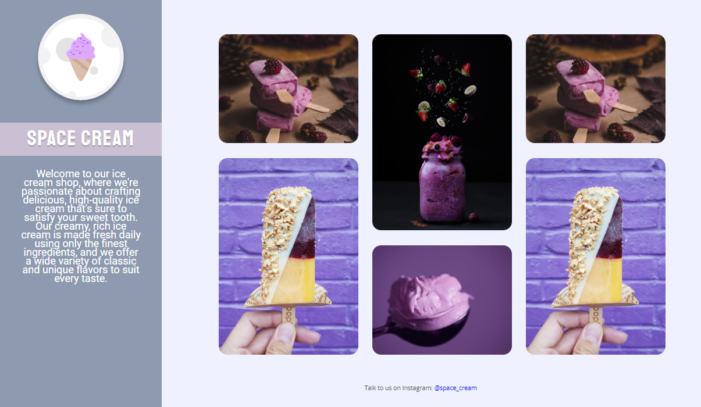
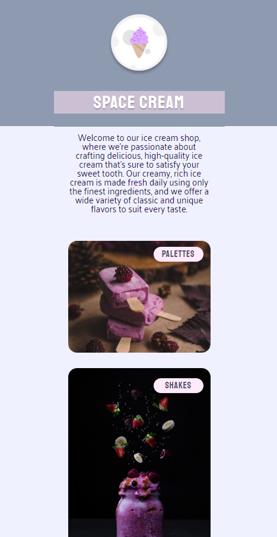

# TIMER 2.0

> Project built as a challenge to the student during Rocketseat's Explorer trail classes.

    The challenge was to create all the HTML and CSS from a FIGMA model, improving knowledge about display grid, responsiveness, mobile first, transitions, transformations and animations with CSS.

🔗 [Click here to access](https://mbslash.github.io/Space-Cream/)

## 💻 Technologies

- HTML
- CSS
- Figma
- Git & GitHub

## 📧 Contact

matheusb.dev@gmail.com